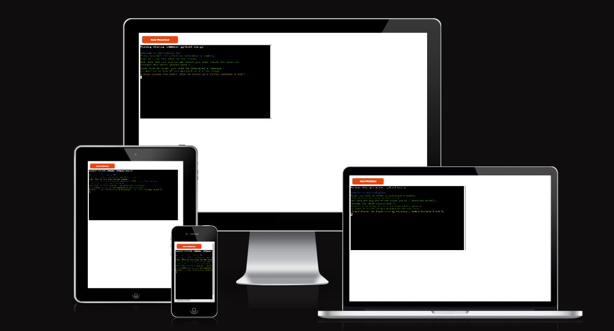
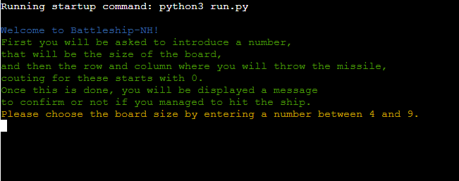
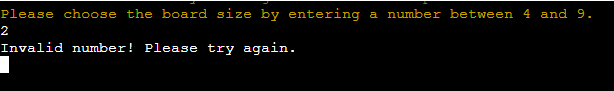
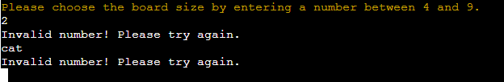
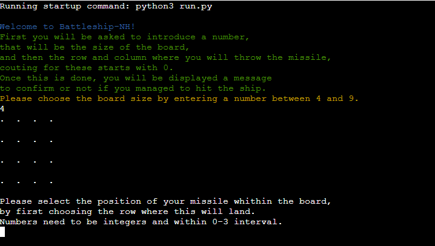
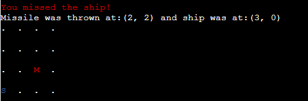
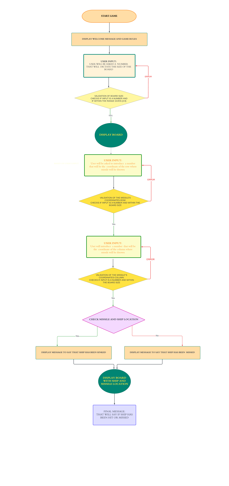
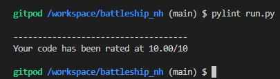

# Battleship NH
## Introduction
Battleship NH is a Python terminal game, which can be played in the Code Institute mock terminal on Heroku. User can try to play against the computer, by guessing the correct location of computer's ship.

[Live Version](https://battleship-nh.herokuapp.com/)

## How to Play
Battleship NH is a game inspired by the classic pen-and-paper Battleships game, except that in this game the player is the only one to guess the location of the ship, which has randomly been located by computer. 
Once the game starts, the player will be asked to enter a number between 4-9, which will dictate the size of the square game board. For example, if 5 is given then the board will have 5 rows and 5 columns. After this, the board will be displayed, and the user will be asked to enter two numbers that will be the position of where his missile will land. These numbers are the missile's coordinates, first will be the number for the row, which after being introduced will need to be validated, only after the first number is validated second number, for the column, can be introduced. 
In the end, user will be shown a message that will say if the ship has been hit or missed, and the board with the exact location of the ship and missile displayed.

## User Stories 
  * As a user, I would like select the size of the board.
  * As a user, I would like to see where the ship was actually located after I have thrown missile.

## Features
### Existing Features
  1. When the game starts: the user is shown a welcome message and the game rules. 

  

  2. The user is asked for a number, which will be the board size. If the number is not an integer or within the interval given he is shown a message and asked to try again.

  

  

  3. User is shown the board.
  4. User is asked for the row number for where the missile will be located. If the number is not an integer or within the board size he is shown a message and asked to try again.

  

  5. User is asked for the column number for where the missile will be located. If the number is not an integer or within the board size he is shown a message and asked to try again.
  6. User is shown the final message that will confirm whether or not the ship has been sinked. 
  7. User is shown the board with the position of the missile and ship if missed the ship, or the position of the missile only if ship has been hit. 

  

  

### Features Left to Implement
  * To allow the player to throw more than one missile and computer to have more than one ship
  * To retain player's name and scores and be able to save this data on an external spreadsheet
  * To improve the design and the background of the screen when the game is played. 

## Code Structure 
The steps within the game have been generated by following this diagram created with Lucidchard app. 

## Technologies used 
* GitHub

The project repository has been created in Github.
* Gitpod

The code has been written in Gitpod.
* Heroku

Project has been deployed on Heroku. 
* Python

The app has been build using python program. 

## Testing 
I have tested the code is functioning and checking the inputs given by the user, to make sure these meet their criterias. The inputs need to be numbers and within the range given. On any wrong input user is shown message that input is invalid and another input is expected.

### Validation
I have used the pycodestyle library to help me find and solve the errors in my code. 

### Fixed Bugs 
* Before changing it, the ship's coordinates were generated by calling the function after the user has guessed the missile's location. This has been fixed by changing the order in which the functions are called within the main function. 
* Before changing, the random numbers that will be the missile coordinates were within 0 and board size, which had to be corrected as the rows and columns index starts actually from 0, so the interval had to be changed to 0 and `board_size-1`. 
* Similar aspect, as above, had to be taken into consideration for the missile coordinates, the user's input: which needs to be smaller than the board size and not smaller and or equal.
* When validating the user's inputs they had to be transformed in integers, as otherwise, we wouldn't be able to check equality between a number and a string. 

## Deployment

### Heroku
The project is deployed on Heroku. The steps are as follow:

1. In your project: Create requirements.txt file with
 pip3 freeze > requirements.txt
2. Create Heroku account.
3. Create new project. 
4. Pick Github and find the repo with the project you want to deploy.
5. Go to Setting and press Reveal Config Vars.
4. You must then create a _Config Var_ called `PORT`. Set this to `8000`
5. Underneath add the following buildpacks:
      1. `heroku/python`
      2. `heroku/nodejs`
5. Go to Deploy button, pick which branch you want to deploy - was main in my case.
6. Click deploy and wait until the project is build, watch out for any errors.

### Gitpod
After opening the repository in GitHub, you can press on Gitpod button which will take you to Gitpod. In Gitpod app is run by pressing `python3 run.py`.

## Media Credits 

Diagram has been created using: 
[Lucidchard](https://www.lucidchart.com/pages/)

Python code has been written with inspiration from:
* [Code Institute](https://codeinstitute.net/)
As using the idea provided in Portofolio Project 3 Scope. 

And with extra support from:
* [Code Institute](https://codeinstitute.net/)
* [Slack](https://slack.com/intl/en-gb)
* [W3schools](https://www.w3schools.com/js/)
